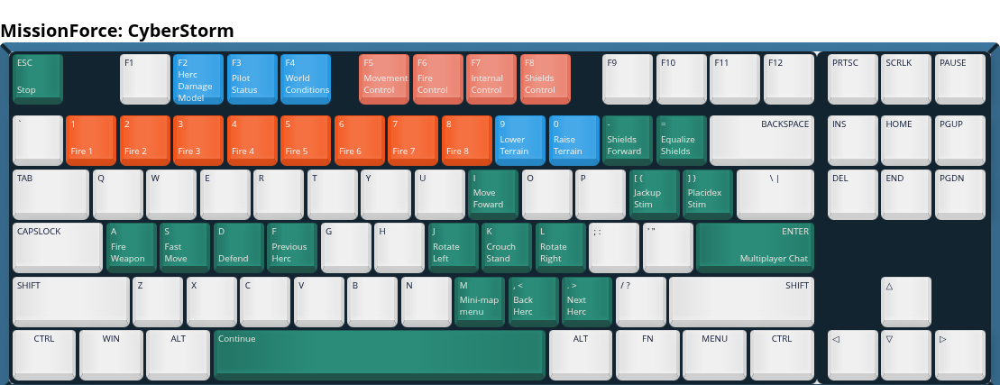

  

A fan-driven historical archive dedicated to MissionForce: CyberStorm; Sierra’s dark, tactical science-fiction wargame that combined brutal turn-based combat, persistent pilots, and corporate warfare into one of the most unforgiving strategy experiences of the 1990s.

# Motivation
Despite its age, *MissionForce: CyberStorm* is not truly dead. Player uploads, scattered discussions, and surviving archives prove there is still a pulse beneath the surface. More importantly, the game remains fully playable on modern systems and is legally available through [GOG.com](https://www.gog.com/en/game/missionforce_cyberstorm), creating a rare opportunity to introduce a new generation of players to one of Sierra’s most overlooked strategy titles.

The challenge is visibility. CyberStorm suffers from decades of underrepresentation in gaming media, disappearing fan sites, and mechanics that were never properly explained to newcomers. For many players, the barrier is not the game itself; it is simply discovering how deep and rewarding it actually is.

Other classic communities have already demonstrated what is possible when passionate fans refuse to let a game disappear. Projects like [OpenTTD](https://www.openttd.org/), [OpenXcom](https://openxcom.org/), and [OpenRCT2](https://openrct2.io/) transformed aging titles into thriving modern communities through preservation, documentation, multiplayer support, and community-driven development.

There is no reason *MissionForce: CyberStorm* should remain without a community presence. The foundation still exists; the game is obtainable, functional, and mechanically unique even by modern standards. What is missing is a centralized effort to preserve knowledge, document its systems, archive its history, and make entry into the game approachable for new players.

# Ways to play
1. **Digital Release**  
   [GOG.com](https://www.gog.com/en/game/missionforce_cyberstorm) sells the game for approximately **$5.99 USD**.  
   This release includes the **v1.1 patch** and runs out of the box on modern systems, aside from missing links to the external Windows help and manual files.

2. **Original CD Release**  
   [eBay](https://www.ebay.com) frequently has loose CD copies available for around **$10.00 USD**, while complete boxed copies typically sell for around **$60.00 USD**.  
   Physical releases usually require manual intervention to install updates and run properly on modern operating systems.

3. **Preservation Copy**  
   [Archive.org](https://archive.org/details/missionforce-cyberstorm) hosts preserved `.iso` image of the game.  
   This versions also require manual intervention to install patches and configure compatibility on modern systems.

# Preservation status
## Visual Formats
**ANX → PNG Conversion:** `746 / 746` files converted\
**BMX → PNG Conversion:** `152 / 152` files converted\
*Tools used:* [anx bmx converter](./tools/anx%20bmx/anx%20bmx%20converter.html)\
*Explanation:* `.anx` and `.bmx` are the same format under different file extensions. They contain visual pixel data and may contain multiple frames. The majority of files rely on externally defined `.plx` color palettes, while some files embed their own palette information.

Some images also contain “cutouts” specific regions whose palette information can be dynamically changed by the game’s code. This allows simple animation effects, such as the blinking lights on HERC, without requiring separate image frames.

**FLX → PNG frames Conversion:** `256 / 256` files converted\
*Tools used:* [flx converter](./tools/flx/flx%20converter.html)\
*Explanation:* `.flx` files are used to display sequenced visual data. With no audio files contained within; audio information is synchronized by a frame counter in code.

Similar to `anx/bnx` files, some `.flx` files contain embedded `.plx` palette data. Additionally, some files are stored in an “upside-down” configuration.

**AVI → AVI Conversion:** `3 / 3` files converted\
*Tools used:* No conversion needed.

**EXE → CUR & PNG Conversion:** `7 / 7` files converted\
*Tools used:* [Resource Hacker](https://www.angusj.com/resourcehacker/)

**ICO → ICO Conversion:** `3 / 3` files converted\
*Tools used:* No conversion needed.

**FNX → TTF & PNG Conversion:** `6 / 6` files converted\
*Tools used:* [fnx converter](./tools/fnx/fnx%20converter.html)\
*Explanation:* `.FNX` files are fonts with a shading, gradient, or shadow effect (fat). Without the gradient applied, the text can be difficult to read. A readable (slim) version is also provided, as modern font formats do not support the gradient effect.

**ART → PNG Conversion:** `1 / 1` files converted\
*Tools used:* [art converter](./tools/art/art%20converter.html)

## Audio Formats
**WAX → WAV Conversion:** `439 / 439` files converted\
*Tools used:* [SoX](https://sourceforge.net/projects/sox/) & [wax2wav.py](https://github.com/juanitogan/rbxit/blob/master/tools/wax2wav.py)\
*Explanation:*  **wax2wav.py** is used to supply **SoX** required header information to perform the conversion.

**CD Audio → FLAC & MP3 Conversion:** `3 / 3` files converted\
*Tools used:* **Windows Media Player Legacy**

**OGG → OGG Conversion:** `3 / 3` files converted\
*Tools used:* No conversion needed.

**PLX → GPL Conversion:** `39 / 39` files converted\
*Tools used:* [plx converter](./tools/plx/plx%20converter.html)\
*Explanation:* `.plx` files contain color palette information used by other file formats. `.anx`, `.bmx`, and `.flx` files can also contain embedded `.plx` data. The modern equivalent is the `.gpl` **GIMP Palette** format, which is also the palette format used by **Aseprite**.

## Data Formats
**RBX → RBX Conversion:** `4 / 4` files converted (Not included in this repo)\
*Tools used:* [rbx converter](./tools/rbx/rbx%20converter.html)\
*Explanation:* `.rbx` files are archives that contain game assets. Since the files contained within them will already be preserved in the `raw files` folder, there is no need to duplicate the archive contents.

**TXT → TODO Conversion:** `0 / 17` files converted\
*Tools used:* 

**XLS → TODO Conversion:** `0 / 1` files converted\
*Tools used:* 

**BOX → PNG Conversion:** `35 / 35` files converted\
*Tools used:* [box converter](./tools/box/box%20converter.html)\
*Explanation:* `.box` files define rectangular UI placement and dimensions, while `.png` files are used to visualize their contents.

**PLY → PNG Conversion:** `5 / 5` files converted\
*Tools used:* [ply converter](./tools/box/ply%20converter.html)\
*Explanation:* `.ply` files contain vector information to generated 2D polygons for mouse hover trigger events. `.png` files are used to visualize their contents.

**XXX → XXX Conversion:** `1 / 1` files converted\
*Tools used:* No conversion needed.\
*Explanation:* The file is a compressed copy of the **Miles DirectSound driver**. The `.xxx` extension is used to prevent Microsoft Windows from treating the file as a `.dll` and interfering with the process.

**MVB → (temp)RTF → HTML Conversion:** `1 / 1` files converted\
*Tools used:* [HelpDeco V2.1](https://www.oocities.org/mwinterhoff/helpdeco.htm) & [Soffice](https://github.com/beenotung/soffice) & [rtf converter.sh](./tools/rtf/rtf%20converter.sh)\
*Explanation:* **HelpDeco** exports text into `.rtf` and images as `.shg`. `.rtf` documents were fed by **rtf converter** into **Soffice** to generate `.html` files. The `.html` files took manual corrective measures afterwords.

**SHG → BMP Conversion:** `155 / 155` files converted\
*Tools used:* [HelpScribble](https://www.helpscribble.com/)\
*Explanation:* `.shg` files are more than just images; they can also contain mouse-clickable zones, similar to HTML image maps. When a `.shg` file represented a visual menu, a corresponding HTML file was manually created to contain the HTML image map.

**BIN → CSV Conversion:** `41 / 41` files converted\
*Tools used:* [bin converter](./tools/bin/bin%20converter.html)\
*Explanation:* The game’s `.exe` references `.bin` files to handle language and string substitutions for localization. Because the text is separated from the executable’s function calls, it can be difficult to trace on-screen text back to the corresponding `.exe` caller function. The [bin tracker](./modern/bin%20tracker.csv) is used to assist with searching, mapping, and identifying these references.

### Replacment [Help/Manual Website](https://www.corgo.org/cs-help/) is online.

[Installation Guide](./publications/Installation%20Guide.pdf), [Quick Reference Card](./publications/Quick%20Reference%20Card.pdf), [Prima Strategy Guide](./publications/Prima%20Strategy%20Guide.pdf), MVIEWER2.EXE & METALSTO.MVB replaced with [cs-help](https://github.com/TeamCorgo/CS-Help) (sub project), InterAction Magazine issues [27](./publications/InterAction%20Issue%2027%20(Summer%201996).pdf), [28](./publications/InterAction%20Issue%2028%20(Fall%201996).pdf), [29](./publications/InterAction%20Issue%2029%20(Holiday%201996).pdf), [30](./publications/InterAction%20Issue%2030%20(Spring%201997).pdf), Patch v1.1 [documents](./raw%20game%20assets/V1.1%20Patch%20Docs.zip).

Next step: HQ game box scans are needed, CD game case, Demo discs.

# Publications
## Prima Strategy Guide
John Sauer wrote an [official strategy guide](./publications/Prima%20Strategy%20Guide.pdf) for MissionForce: CyberStorm under the Prima Publishing label. Produced with direct support from Dynamix, the guide provides extensive gameplay information, mechanics explanations, and strategic insight that were largely absent from the retail release.

Given the depth and importance of its content, the guide arguably should have served as the in-box manual for players.

## Quick Reference Card
The game came with a [quick reference Card](./publications/Quick%20Reference%20Card.pdf) which seemingly contains unique information, such as keyboard hotkeys.

It also informs the player of the maximum commander rank achievable within a star system. Not knowing this can cause players to grind unnecessarily (Missing Promotion Points). The card also includes a cost-to-performance comparison chart for purchasable derms (Missing learn rates). While this information exists in-game, it is only shown one item at a time, making direct comparison difficult.

A major highlight is the keyboard hotkeys. The game can become grind-heavy, so these shortcuts are an important quality-of-life tool:

- Crouch/Stand: `K`  
- Move shields forward: `-`  
- Inject derm with Jackup: `[`  
- Show/Hide terrain: `0` & `9`  
- Next/Previous HERC: `<` & `>`  
- End turn: `Ctrl + E`

Staying on the Fire Control Panel as much as possible significantly speeds up overall gameplay.

However, gameplay patterns show that players often neglect the Crouch and Jackup mechanics, as they are usually not worth the time investment in most situations. This leads to them being forgotten in moments where they are most needed.

My typical workflow is to spam `-[>` at the start of each battle, then ending each turn with `K>` ending with `Ctrl + E`.

A keyboard graphic was generated based on the information provided in the Quick Reference Card.

  

## InterAction Magazine
*InterAction* was a dedicated promotional magazine published by Sierra On-Line starting in June 1991. Archival pages were sourced from [Retromags](https://www.retromags.com/files/category/206-interaction/).

### Issue 27 (Summer 1996) [PDF](./publications/InterAction%20Issue%2027%20(Summer%201996).pdf)
- Pages 28–31 showcase the game using prerelease assets.
- Advertises the inclusion of two copies in each box to encourage online play.

### Issue 28 (Fall 1996) [PDF](./publications/InterAction%20Issue%2028%20(Fall%201996).pdf)
- Page 7 sells a swag T-shirt featuring *MissionForce: CyberStorm* branding.
- Page 13 lists *CyberStorm* as #4 in the Top 10 Entertainment rankings.
- Pages 68–71 contain a multi-page article praising the multiplayer experience, although gameplay imagery is sparse.

### Issue 29 (Holiday 1996) [PDF](./publications/InterAction%20Issue%2029%20(Holiday%201996).pdf)
- Page 10 lists *CyberStorm* as #7 in the Top 10 Entertainment rankings.
- Pages 96–97 promote multiplayer features, the [www.sierra.com/cyberstorm](https://web.archive.org/web/19970214174036/http://www1.sierra.com/games/cyberstorm/index.html) website, and the message board.
- References daily tournaments with approximately 200 participants in the Red Max's 1996 *Storm Watch Challenge*. While not hosted directly by Sierra, the company provided prizes and official rules.
- The utility *Madaxe's HercView* is endorsed and made available for download.
- A bundle containing 96 HERC save file was also distributed.
- Cheat codes were published through the [goodies webpage](https://web.archive.org/web/19970214174036/http://www1.sierra.com/games/cyberstorm/index.html), which appears to have been the primary source for updates, with indications that new codes may have been added monthly.

### Issue 30 (Spring 1997) [PDF](./publications/InterAction%20Issue%2030%20(Spring%201997).pdf)
- Page 87 announces *CyberStorm 2* with the casual mention:

> "If you are one of the zillion people who demanded more of MissionForce: CyberStorm, then the creative team of designers at Dynamix is putting together a game you're gonna love."

- *CyberStorm* was absent from the Top 20 section on page 96.

## Installation Guide
The [installation guide](./publications/Installation%20Guide.pdf) is nearly useless and represents the absolute bare minimum of acceptable documentation on how to install and troubleshoot. It also briefly hints that some sounds were sourced from the "Sound Ideas® sound effects library."

# Downloads
## Madaxe's HercView 1.1
James Parker “Madaxe” created a utility called HercView that enabled players to view and print `.hrc` files outside of CyberStorm ([example](./downloads/HercView/Example.pdf)). The tool received direct support from Sierra On-Line, being hosted on Sierra’s “Extra Goodies” page and later referenced in InterAction Issue #29.

The version provided requires [installation](./downloads/HercView/Installer.zip), while a [portable](./downloads/HercView/Portable.zip) edition has been created for preservation purposes.

The Herc Base Alpha website documents the `.hrc` [file specification](https://web.archive.org/web/19991007062427/http://www.uncg.edu/%7Ejsrobard/CS_Hacking.htm#edit_cbs), making it straightforward to develop a modern implementation.

## HERCs R Us
Sierra produced a collection of [89 custom .hrc](./downloads/89_Hercs.zip) files as a special release for Christmas 1996. Issue 29 of InterAction states that the files were created by Dynamix QA technician Matthew Vincent.

Without additional tools, `.hrc` files are difficult to effectively use or evaluate in single-player. If a player's technology level exceeds the HERC design, the imported HERC becomes underpowered. Conversely, if the `.hrc` file requires a higher tech level than the player has achieved, the HERC cannot be imported at all.

## Cyberstorm Demo
Sierra provided a free [promotional demo](./downloads/CyberStorm%20Demo.zip) of MissionForce: CyberStorm, available both as a downloadable release from the [Sierra website](https://web.archive.org/web/19970113114416/http://www1.sierra.com/games/cyberstorm/demo/readme.html) and on CD-ROM. The demo allowed players to experience three pre-made sample missions, though multiplayer functionality was not included.

## v1.1 Patch
[Patch v1.1](./downloads/v1.1%20Patch.zip) was a major overhaul for the game, introducing Hotseat multiplayer and Play-by-Email multiplayer support. It also rebalanced gameplay, particularly around the first Elite mission, added additional cheats and openly documented them within the game files, and introduced the Opportunity Fire mechanic, allowing both players and AI units to take reactive “overwatch” shots. Technically the update is named v1.10a; however, the community commonly refers to it as v1.1.

With the sheer number of improvements and gameplay refinements, v1.1 stands as the quintessential way to experience the game. No other updates or patches were officaly released by Sierra / Dynamix.

## v1.2 Homebrew Patch
The fans `Crow!`, `Seraphim`, `borg_down`, `siopaomanX` on [The Junkyard forums](https://web.archive.org/web/20121128141129/http://forums.the-junkyard.net/showthread.php/8480-Cyberstorm-Single-Player-V1.2-(Now-it-actually-works!)) created a ["v1.2" homebrew patch](./downloads/v1.2%20Homebrew%20Patch.zip) for the single-player campaign in 2007. The patch primarily focuses on increasing the game’s difficulty by modifying the equipment loadouts used by Cybrid enemies.

Special thanks for the dedication and expertise required to create such a patch. Rebalancing a complex strategy game at this level demands a deep understanding of its mechanics, enemy scaling, and overall campaign flow (Dynamix has 14 Quality Assurance Analysts listed in the credits). Truly legends!

## Windows Theme (Fan made)
Hosted on the [Official CyberStorm Site](https://web.archive.org/web/19970321071832/http://www.techline.com/~outlaw/guns/cs/) created by `RAtt` and `Lemming` is a downloadable [MSPlus Windows theme](./downloads/Windows%20Theme.zip).

No credits are attributed, however the theme appears to be reasonably well developed, featuring images, cursors, and sound effects taken directly from the game. For 1996, it is quaint and genuinely charming to see a fan-made Windows theme produced for the game, reflecting the era when desktop customization packs were a popular part of PC gaming culture. Sadly, there is no surviving context explaining how the assets were extracted or who specifically authored the theme. However, the startup screen links directly to the official CyberStorm fan site, making `RAtt` or `Lemming` the most likely creators.

# Lost Media
- In `Crow!`'s post publishing the v1.2 homebrew patch, he refrences "Seraphim's release of a very thorough description of the cybrid models has enabled us to locate the designs for the official Cybrid Hercs inside the CSTORM.EXE file." These documents apear to have never been published on The Junkyard forum or elsewhere. There is another refrence "I can't seem to find Seraphim's excellent Cybrid hacking spreadsheets online anywhere, so I'll repost them." however those documents were not followed up [on the thread](https://web.archive.org/web/20150913143342/http://forums.the-junkyard.net/showthread.php/9667-Cyberstorm-1-new-content).
- `dudejo` created a modified `.exe` featuring altered player weapon statistics. It was [published on The Junkyard](https://web.archive.org/web/20150127185830/http://forums.the-junkyard.net/showthread.php/9930-in-case-we-ever-find-how-to-change-weapon-stats), but the file itself was hosted on RapidShare. Recovery may prove difficult, as there is little identifiable branding or naming information to trace the upload. ~2010  
- [StormWatch Challenge details](https://web.archive.org/web/19970214174036/http://www1.sierra.com/games/cyberstorm/index.html). These were multiplayer tournaments with prizes supplied by Sierra. StormWatch Challenge #1 appears to have been canceled due to technical difficulties. StormWatch Challenge #2 appears to have been completed, though details such as the winners remain unkown. StormWatch Challenge #3 was [announced as “coming soon”](https://web.archive.org/web/19970615081413/http://www.techline.com/~outlaw/guns/cs/), but no further information has surfaced. ~1996

# Found Media!
- `Crow!`'s documentation, [Cybrid Herc Design Listings.zip](./downloads/Cybrid%20Herc%20Design%20Listings.zip) and [Documentation.zip](./downloads/Documentation.zip), from [The Junkyard archive thread](https://web.archive.org/web/20150913221046/http://forums.the-junkyard.net/showthread.php/9780-Cyberstorm-Hexing-info). These instructions review how to hex edit the game to play as Cybrids! The absolute legend [LeadProphet](https://github.com/LeadProphet) is the one responsible for preserving this.
> "You CAN, however, play the game as Cybrids. There are several bugs that need to be worked around to make this happen without crashing, but we have had several play by email games as either cybrid vs cybrid or cybrid vs human. I also played as Cybrids in the single player campaign, but it's absolutely brutal. A hit to a Cybrid damages all components equally, so that means a damaged Cybrid technically has a damaged life support. I highly recommend it if you're looking for a challenge." ~2007

# Game Credits
**Executive Producer:** Jay Balakrishnan\
**Producer:** Graeme Bayless\
**Associate Producer:** Don McClure

**Creative Director:** John Garvin

**Lead Software Engineer:** Stephen Cordon\
**Software Engineers:** David McClurg, Miles Smith, Jimmy Campbell\
**Multiplayer Engineer:** Langdon Beeck\
**Additional Programming:** Christopher K. Singleton, Brian Danielson, Phil Taylor, Rhett Anderson, Dynamix "Darkstar" Engineering Group

**Art Directors:** John Garvin, Mike Jahnke, Shawn Sharp\
**Art Resource Coordination:** Jay Dee Alley\
**Herc Designs:** Shawn Sharp\
**Production Artists:** Douglas Brashear, Barry Drew, Mary Ann Fernandes, Ron Clayborn, Point Asia\
**Additional Art:** Vance Naegle, Dan Buendia

**Game Design:** John Garvin, Graeme Bayless, Don McClure, Robert Kraft, Stephen Cordon\
**Storyline:** Robert Kraft\
**Additional Writing:** J. Steven York\
**Assistant Director:** Robert Kraft\
**Scriptors:** Don McClure, Gerald Azenaro

**Quality Assurance Manager:** David Steele\
**Quality Engineer:** Scott Gilbert\
**Quality Assurance Technician:** John Wolf\
**Quality Assurance Analysts:** Andrew Binder, Chris Stafford, Trish Bayless, Erinn C. Hamilton, Ben Nahorney, Alan Roberts, Aaron Anderson, Garrett Turner, Ken Eaton, Kenny Smith, Christa Wendland, Daniel Hinds, Gary Stevens, Matthew Vincent

**Brand Manager:** Barbara Schwabe\
**Marketing:** Jaymi Bauer\
**Public Relations:** Barbara Dawson\
**Creative Services:** Heather Lavin\
**Packaging Art Direction:** Maria Mason

**On-line Manual Writing:** Kevin Lamb\
**On-line Manual Graphic Design:** Egil G. Gløersen

**Sound Engineer:** Ken Rogers\
**Music:** [Loudmouth](https://dynamix.fandom.com/wiki/Loudmouth)\
The game credits **Sound Ideas® sound effects library**.

**Video Production:** James Carey, David Aughenbaugh

